# Restaurant API

## Описание

Это REST API для ресторана. Оно позволяет создавать, редактировать, удалять и получать информацию о блюдах, заказах,
позициях заказа, пользователях и отзывах. Также есть возможность обрабатывать заказы прямо на сервере в отдельных
потоках.

### Технологии

- Ktor - асинхронный API сервер.
- Exposed - ORM для работы с базой данных.
- PostgreSQL - база данных.
- JWT - для аутентификации.

### Шаблоны проектирования

Я использовал шаблон проектирования, похожий на MVC. Все запросы обрабатываются в контроллере, который в свою очередь
вызывает методы модели. Модель обращается к базе данных и возвращает результат контроллеру. Контроллер возвращает
результат клиенту.

В папке `schemas` находятся модели для взаимодействия с базой данных. Также в этой папке находятся репозитории
(services), которые используются для взаимодействия с базой данных. Поскольку в официальной документации репозитории
назывались, как сервисы, я решил это так и оставить.

В папке `models` находятся модели, которые используются для валидации данных (реквестов), полученных от клиента.

В папке `plugins` находятся файлы, в которых инициализируются плагины и библиотеки.

В папке `services` находятся обработчики и вспомогающие сервисы. Например,

- **DateService** - это сервис для работы с датами и их преобразованиями.
- **JwtService** -это сервис, который нужен для работы с токенами.
- **HashService** - для хеширования и валидации паролей и генерации соли хеша.
- **OrderHandler** - для обработки заказов в отдельных потоках.

В папке `controllers` находятся контроллеры, которые обрабатывают запросы клиента.

- **Контроллеры**

UserController (регистрация, авторизация, получение информации о пользователе): "/user/"

1) "/register" - регистрация пользователя.
2) "/login" - авторизация пользователя.
3) "/getAllUsers" - получение всех пользователей.
4) "/getByLogin" - получение пользователя по логину.
5) "/deleteById" - удаление пользователя по id.

DishController (работа с блюдами): "/dish/"

1) "/add" - добавление блюда.
2) "/getAll" - получение всех блюд.
3) "/deleteById" - удаление блюда по id.
4) "/deleteByName" - удаление блюда по названию.
5) "/update" - редактирование блюда.

OrderController (работа с заказами): "/order/"

1) "/add" - добавление заказа.
2) "/getAll" - получение всех заказов.
3) "/getById" - получение заказа по id.
4) "/serve" - обработка заказа.
5) "/updateOrderStatusById" - обновление статуса заказа по id.
6) "/deleteAllReadyOrders" - удаление всех готовых заказов и позиций.
7) "/deleteAllCanceledOrders" - удаление всех отмененных заказов и позиций.
8) "/deleteByCustomerId" - удаление заказа по id клиента.
9) "/deleteById" - удаление заказа по id.
10) "/getStatusById" - получение статуса заказа по id.
11) "/pay" - оплата заказа.
12) "/cancel" - отмена заказа.

ReviewController (работа с отзывами): "/review/"

1) "/getReviewsByDishId" - получение отзывов по id блюда (отзывы блюд).
2) "/deleteById" - удаление отзыва по id.
3) "/deleteByUserId" - удаление отзывов по id пользователя.
4) "/update" - редактирование отзыва.
5) "/add" - добавление отзыва.

PositionController (работа с позициями заказа): "/position/"

1) "/add" - добавление позиции заказа (когда посетитель выбирает блюда в ресторане к своему заказу).
2) "/getAllPositions" - получение всех позиций заказа.
3) "/getAllPositionsByOrderId" - получение всех позиций заказа по id заказа.
4) "/updateStatus" - обновление статуса позиции заказа.
5) "/deleteById" - удаление позиции заказа по id.
6) "/deleteByOrderId" - удаление всех позиций заказа по id заказа.

StatsController (статистика): "/stats/"

1) "/getMostPopularDishes" - получение самых популярных блюд.
2) "/getAverageDishRating" - получение средней оценки блюда.
3) "/getOrdersCountByPeriod" - получение количества заказов за период.

- **Сервисы + Модели**

#### DishesService (сервис для работы с базой данных блюд):

**Таблица Dishes:**

1) id - уникальный идентификатор блюда (long).
2) name - название блюда (varchar(256)).
3) quantity - количество блюд (integer).
4) price - цена блюда (double).
5) cook_minutes - время приготовления блюда в минутах (integer).

#### OrdersService (сервис для работы с базой данных заказов):

**Таблица Orders:**

1) id - уникальный идентификатор заказа (long).
2) customer_id - id клиента (long).
3) status - статус заказа (OrderStatus(64)).
4) paid - оплачен ли заказ (boolean).
5) paid_sum - сумма заказа (double).
6) created_at - дата создания заказа в секундах (long).

#### PositionsService (сервис для работы с базой данных позиций заказа):

**Таблица Positions:**

1) id - уникальный идентификатор позиции заказа (long).
2) order_id - id заказа (long).
3) dish_id - id блюда (long).
4) minutes_left - оставшееся время приготовления блюда в минутах (integer).
5) status - статус позиции заказа (OrderStatus(64)).

#### ReviewsService (сервис для работы с базой данных отзывов):

**Таблица Reviews:**

1) id - уникальный идентификатор отзыва (long).
2) user_id - id пользователя (long).
3) dish_id - id блюда (long).
4) rating - оценка блюда (integer).
5) comment - комментарий (varchar(256)).

#### UsersService (сервис для работы с базой данных пользователей):

**Таблица Users:**

1) id - уникальный идентификатор пользователя (long).
2) login - логин пользователя (varchar(64)).
3) password_hash - хеш пароля пользователя (varchar(256)).
4) password_salt - соль хеша пароля (varchar(256)).
5) role - роль пользователя (UserRole(64)).

OrderStatus - это enum класс, который содержит статусы заказа: ACCEPTED, PREPARING, READY, CANCELED.
UserRole - это enum класс, который содержит роли пользователя: ADMIN, CUSTOMER.

## Запуск

1) Склонируйте репозиторий: `git clone git@github.com:linkartemy/hse-restaurant-api.git`
   или `git clone https://github.com/linkartemy/hse-restaurant-api.git`
2) Запустите docker compose для запуска PostgreSQL: `docker-compose up`
3) Запустите сервер
4) Далее перейдите в программу PostMan и отправляйте запросы на сервер. Ниже будут приведены инструкции для работы с
   сервером
5) Чтобы импортировать ручки в PostMan, нажмите на кнопку "Import" и выберите
   файл `hse-restaurant-api.postman_collection.json` (любой из двух)

## Сценарии

### Регистрация

1) Откройте ручку user->register
2) Создайте пользователя
3) Полученный токен вставьте в переменную token в environment (см. Авторизация)

### Авторизация

Для начала необходимо авторизироваться.

1) Необходимо добавить токен для аутентификации в PostMan. Для этого введите логин и пароль в соответствующие поля в
   ручке
   "/user/login" и нажмите "Send". 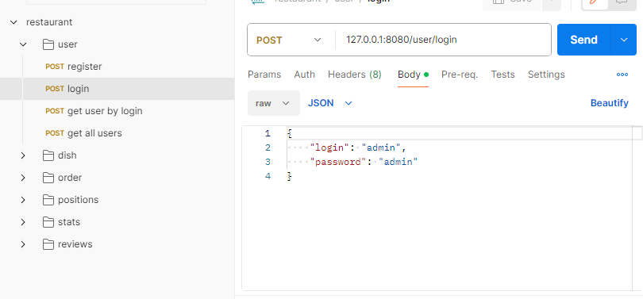
2) После скопируйте токен из ответа сервера и вставьте его в переменную token в
   environment. 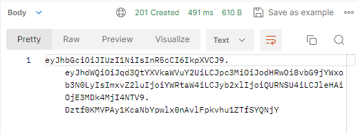 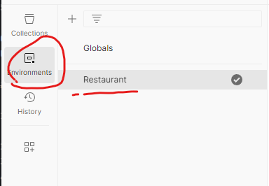 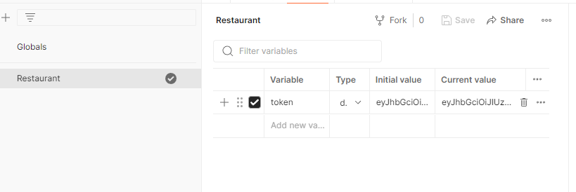
3) Теперь вы авторизированы и можете использовать все ручки.

### Давайте пройдемся по обычному сценарию

Чтобы продемонстрировать все возможности сервера, выполните следующие действия:

#### Добавление блюда

Давайте добавим блюдо в меню. Перейдем в папку dish и в ручку add dish. Добавьте 2 блюда:

```json
{
  "name": "crabsburger",
  "quantity": 10,
  "price": 5,
  "cookMinutes": 2
}
```

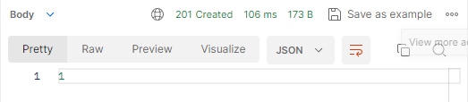

```json
{
  "name": "noodles",
  "quantity": 1,
  "price": 4,
  "cookMinutes": 2
}
```

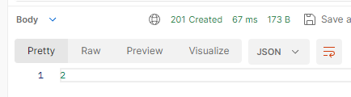

Нам вернулись id блюд. Посмотрим все блюда в меню. Перейдем в ручку get all dishes.

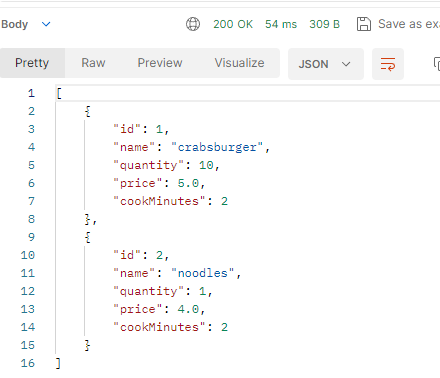

#### Добавление заказа

Теперь представим, что посетитель через клиентское приложение оставил заказ. Чтобы клиентское приложение добавило заказ
в базу данных, необходимо выполнить ручку add order в папке orders. Поскольку id нашего пользователя 1, то мы отправим
следующие данные:

```json
{
  "customerId": 1
}
```

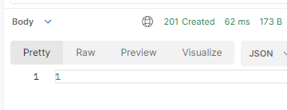

Проверим, что заказ действительно создался. Перейдем в ручку get all orders.

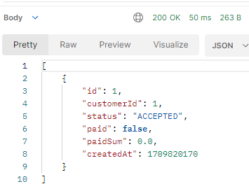

#### Добавление позиций заказа

Теперь необходимо добавить позиции блюд в заказ. Блюда выбирает посетитель, а позиции создает сервер. Перейдем в ручку
add position в папке position. Добавим 2 позиции:

```json
{
  "orderId": 1,
  "dishId": 1
}
```

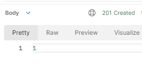

```json
{
  "orderId": 1,
  "dishId": 2
}
```

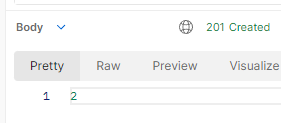

Проверим, что позиции действительно создались. Перейдем в ручку get all positions.

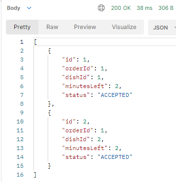

Статус "ACCEPTED" означает, что позиция заказа принята и ожидает начала приготовления.

#### Обработка заказа

Теперь ресторан со своего клиентского приложения видит все заказы и может начать их обработку. Перейдем в ручку serve
order в папке order. Обработаем заказ с id 1:

```json
{
  "id": 1
}
```

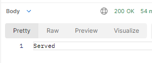

Напомню, что заказ содержит 2 блюда: crabsburger (готовится 2 минуты) и noodles (готовится 2 минуты).

Теперь проверим, что блюда начали готовку. В приложении поситителя должна быть возможность просматривать статус заказа.
Для этого перейдем в ручку get order status by id в папке order.

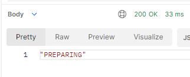

В ручке get all positions (к ней доступ имеет только пользователь с ролью админа) можно посмотреть статусы всех позиций
заказа.

Статусы изменились на PREPARING. Теперь они готовятся:

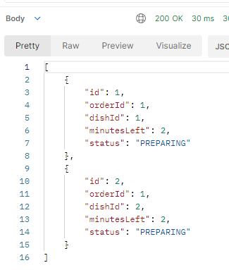

Ждем 1 минуту. Осталась минута:

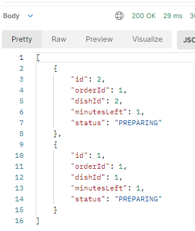

Блюда готовы:

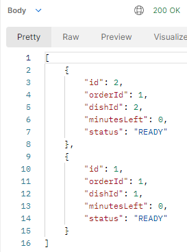

Заказ готов:

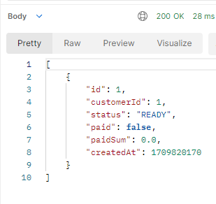

#### Оплата заказа

Теперь оплатим заказ. Перейдем в ручку pay order в папке order. Оплатим заказ с id 1 отправим сумму 8:

```json
{
  "id": 1,
  "paymentSum": 8
}
```

Недостаточно денег:

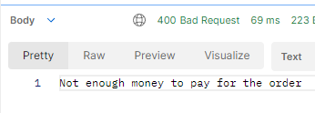

Необходимо заплатить 9. Заплатим 10:

```json
{
  "id": 1,
  "paymentSum": 10
}
```

Заказ оплачен. Сдача 1:

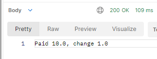

Посмотрим все заказы:

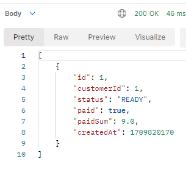

Теперь можно удалить все готовые заказы и позиции. Перейдем в ручку delete all ready orders в папке order:

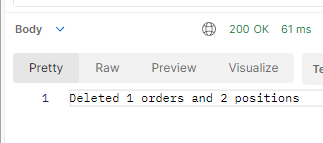

На этом все. Я постарался сделать все user-friendly. Если у вас возникли вопросы, пожалуйста, напишите мне. Я с
удовольствием отвечу на них (ТГ: @linkartemy).